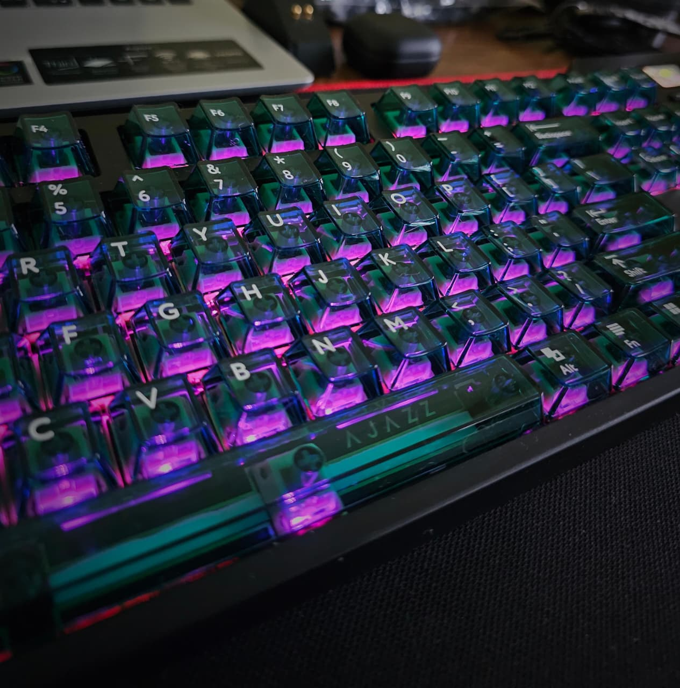
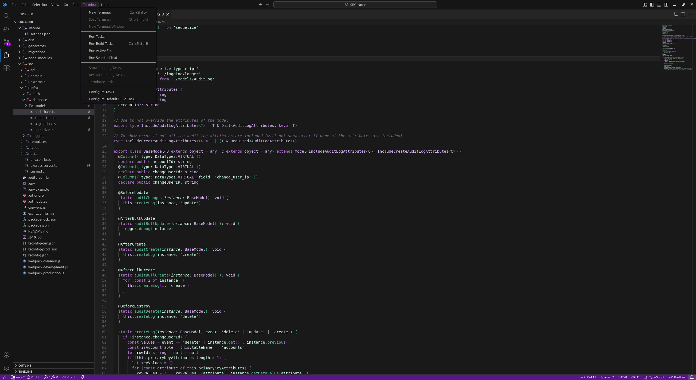
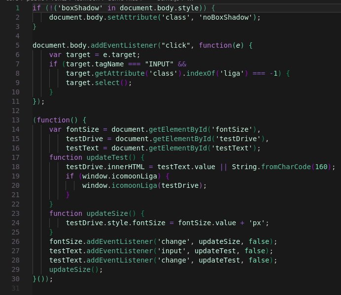

# Grape Glass Theme

## VSCodium Example

## Important

If you have problems using this theme, open a [Issue](https://github.com/V-Perotto/Grape-Glass-Theme/issues/new) and send me a screenshot to analyse your request (check if there is an extension that may be causing these issues)

## Author

[@V-Perotto](https://github.com/V-Perotto)